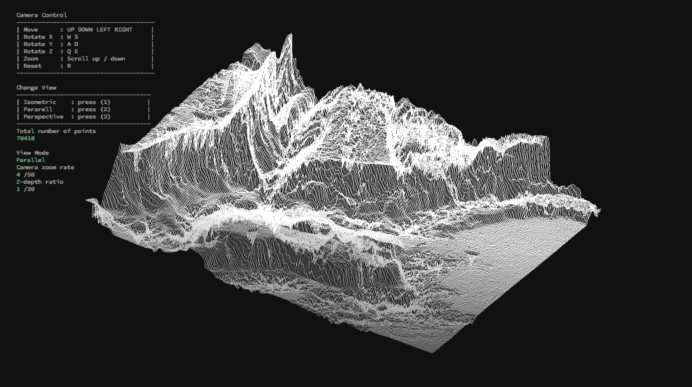
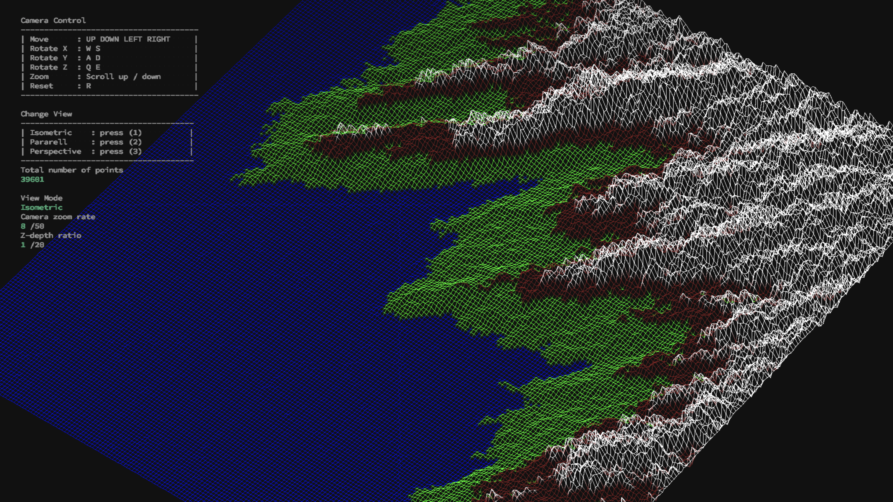
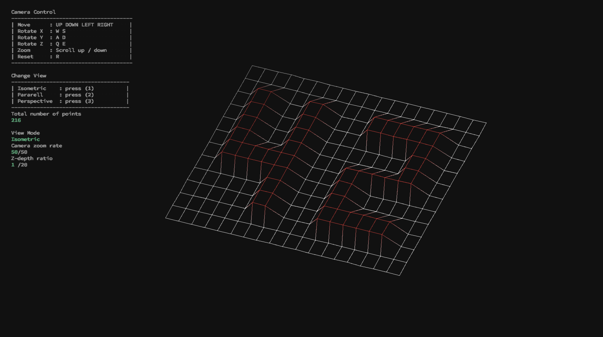

# 3D Wireframe Viewer


## **Features**
'''
./fdf ./test_maps/*.fdf
'''

## **Features**

- **Z-Depth shader** *(points far from the camera gets darker)*
- **RGBA color system** *(gradient color)*
- **Camera controls** *(zoom, translate, rotate 3D)*

```c
// camera transform
move            : Arrow-key (Up Down Left Right)
rotate X        : W S
rotate Y        : A D
rotate Z        : Q E
zoom in         : Mouse scroll-Up
zoom out        : Mouse scroll-Down
reset camera    : R

// Z-depth manipulation
increase height : [
decrease height : ]
```




## Map format (*.fdf)

The coordinates of this landscape are stored in a file (`test_maps/*.fdf`) passed as
a parameter to your program. Here is an example:

```c
// *.fdf file 
0  0  0  0  0  0  0  0  0  0  0  0  0  0  0  0  0  0  0
0  0  0  0  0  0  0  0  0  0  0  0  0  0  0  0  0  0  0
0  0 10 10  0  0 10 10  0  0  0 10 10 10 10 10  0  0  0
0  0 10 10  0  0 10 10  0  0  0  0  0  0  0 10 10  0  0
0  0 10 10  0  0 10 10  0  0  0  0  0  0  0 10 10  0  0
0  0 10 10 10 10 10 10  0  0  0  0 10 10 10 10  0  0  0
0  0  0 10 10 10 10 10  0  0  0 10 10  0  0  0  0  0  0
0  0  0  0  0  0 10 10  0  0  0 10 10  0  0  0  0  0  0
0  0  0  0  0  0 10 10  0  0  0 10 10 10 10 10 10  0  0
0  0  0  0  0  0  0  0  0  0  0  0  0  0  0  0  0  0  0
0  0  0  0  0  0  0  0  0  0  0  0  0  0  0  0  0  0  0
```

Each number corresponds to a point in space:
- The horizontal position corresponds to its axis.
- The vertical position corresponds to its ordinate.
- The value corresponds to its altitude.

## Make (macOS only)

```bash
cd ./source
make
cp ./fdf ../
```
